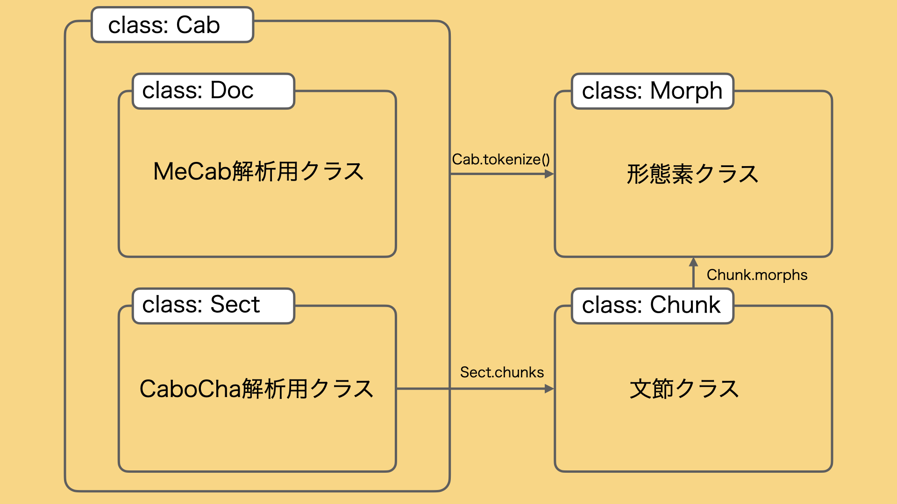
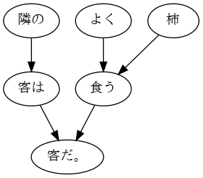

[](https://codeclimate.com/github/tomowarkar/cucurbita/maintainability) [](https://codeclimate.com/github/tomowarkar/cucurbita/test_coverage)         

# cucurbita

MeCab, CaboCha解析結果を分析するツール。

## クラス構成



## Install

```bash
git clone https://github.com/tomowarkar/cucurbita.git
pip install ./cucurbita
```

## Usage
### MeCab
```python
import MeCab
from cucurbita.cab import Doc

m = MeCab.Tagger()
mecab_result = m.parse("隣の客はよく柿食う客だ。")
doc = Doc(mecab_result)
print(doc) 
#> 隣の客はよく柿食う客だ。

print(list(map(str, doc.tokenize())))
#> ['隣', 'の', '客', 'は', 'よく', '柿', '食う', '客', 'だ', '。']

print([token.surface for token in doc.tokenize() if token.pos in ["名詞"]])
#> ['隣', '客', '柿', '客']
```

### CaboCha
```python
import CaboCha
from cucurbita.cab import Sect

c = CaboCha.Parser()
cabocha_result = c.parse("隣の客はよく柿食う客だ。").toString(CaboCha.FORMAT_LATTICE)
sect = Sect(cabocha_result)
print(sect)
#> 隣の客はよく柿食う客だ。

print(list(map(str, sect.tokenize())))
#> ['隣', 'の', '客', 'は', 'よく', '柿', '食う', '客', 'だ', '。']

chunks = sect.chunks
chunk = chunks[0]
print(chunk)
#> 隣の

morphs = chunk.morphs
morph = morphs[0]
print(morph)
#> 隣

print(morph.surface, morph.pos, morph.pos1, morph.pos2, morph.pos3, \
      morph.conj_form, morph.conj, morph.base, morph.yomi, morph.pron)
#> 隣 名詞 一般 * * * * 隣 トナリ トナリ
```

## 文節情報の分析
```python
def relations(sect):
  return [(c.pos, c.dst) for c in sect.chunks]
  
for pos, dst in relations(sect):
  # -1はかかり先なし
  if dst != -1:
    print("{} -> {}".format(sect.chunks[pos], sect.chunks[dst]))

def show_graph(sect):
  from pydot import Dot, Edge, Node
  graph = Dot(graph_type = 'digraph')

  for i, chunk in enumerate(sect.chunks):
      node = Node(i, label = str(chunk))
      graph.add_node(node)

  for i, chunk in enumerate(sect.chunks):
      if chunk.dst != -1:
          edge = Edge(i, chunk.dst)
          graph.add_edge(edge)

  from IPython.display import Image
  display(Image(graph.create(format='png')))

show_graph(sect)
```

